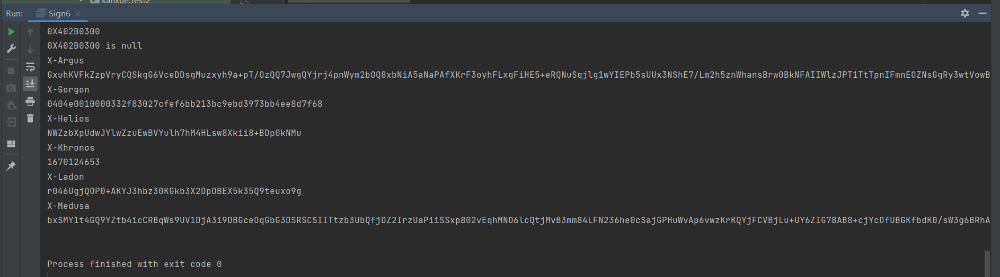

# dy310_unidbg_sign
use unidbg to emulate dy 31.1.0 for X-Medusa and X-Helios

## how to run
1. git clone https://github.com/zhkl0228/unidbg (the version is [3512f1d33c417c2f835430916b58612b0f7d599c](https://github.com/zhkl0228/unidbg/commit/3512f1d33c417c2f835430916b58612b0f7d599c))
4. place "Sign664.java" in the relative directory "unidbg-android/src/test/java/com/ss/android/ugc/aweme"
5. remove the code ```vm.checkVersion(version)``` from the relative path "unidbg-android/src/main/java/com/github/unidbg/linux/android/dvm/DalvikModule.java"
6. place "exe" in the relative directory "unidbg-android/src/main/resources/android/sdk23/proc/self"
6. execute the main function of Sign664.java

## example



